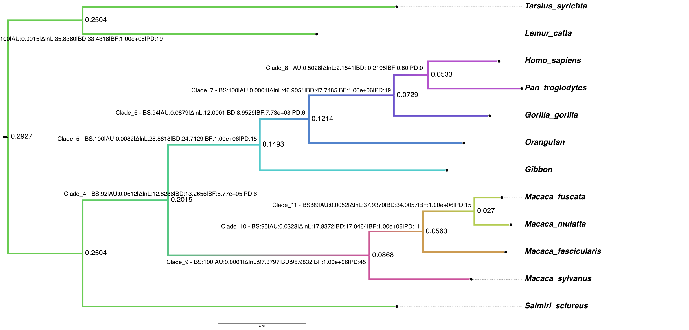
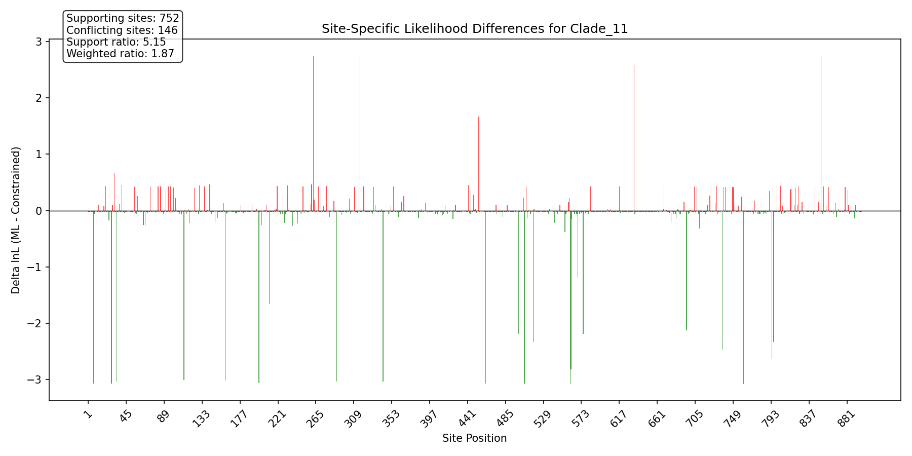
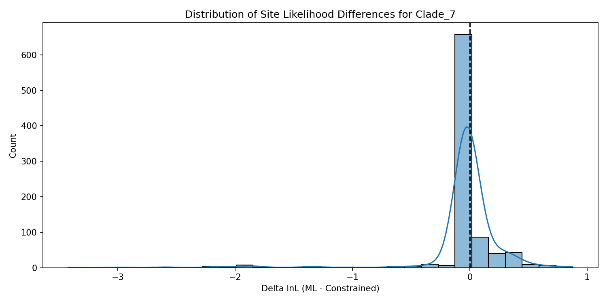

  [](https://opensource.org/licenses/MIT) 

# panDecay: Phylogenetic Analysis using Decay Indices

panDecay is a Python command-line tool for calculating phylogenetic decay indices across multiple analysis frameworks. Version 1.1 introduces major enhancements including **async processing**, **organized output structure**, **YAML configuration**, and **Docker containerization**.

## What's New in v1.1

- **50-80% faster** with async constraint processing
- **Organized output structure** - timestamp-based directories with categorized files
- **Modern YAML/TOML configuration** with Pydantic validation
- **Docker containers** with PAUP* and MrBayes pre-installed
- **Enhanced documentation** with comprehensive guides

[**v1.1 Feature Guide**](docs/MIGRATION_GUIDE.md) | [**Docker Guide**](docs/DOCKER_GUIDE.md) | [**Configuration Guide**](docs/CONFIGURATION_GUIDE.md)

## Key Features

### Organized Output Structure
All analysis results are automatically organized into timestamped directories (`YYYYMMDD_HHMMSS_panDecay_<basename>/`) with categorized subdirectories:
- `results/` - Main results tables and summary files  
- `trees/` - Annotated phylogenetic trees
- `reports/` - Detailed markdown reports
- `visualizations/` - Distribution plots and figures
- `site_analysis/` - Site-specific likelihood analysis (when enabled)
- `logs/` - Debug and analysis log files

### Async Constraint Processing
Enable parallel constraint analysis with `--async-constraints` for significant performance improvements:
- **50-80% faster** analysis for datasets with multiple constraints
- Configurable worker processes and timeouts
- Robust error handling and progress tracking
- Recommended for all multi-constraint analyses

## Documentation

### Getting Started
- **[Tutorial - panDecay 101](docs/TUTORIAL.md)** - Complete beginner's guide with step-by-step examples

### Reference Documentation  
- **[Configuration Guide](docs/CONFIGURATION_GUIDE.md)** - YAML/TOML configuration reference
- **[Docker Guide](docs/DOCKER_GUIDE.md)** - Container deployment and usage
- **[Migration Guide](docs/MIGRATION_GUIDE.md)** - v1.1 features and migration

### Developer Resources
- **[Developer Guide](docs/DEVELOPER_GUIDE.md)** - Architecture, modules, and extension points
- **[API Reference](docs/API_REFERENCE.md)** - Complete API documentation for programmatic use

## Quick Start

### With Docker (Recommended)
```bash
# Build container with all dependencies
./docker/docker-deploy.sh build

# Run analysis 
./docker/docker-deploy.sh run examples/data/alignment.fas --analysis ml --visualize
```

### Traditional Installation
```bash
# Install dependencies
pip install -r requirements.txt

# Run analysis with new async processing
python3 panDecay.py examples/data/alignment.fas --analysis ml --async-constraints
```

## Table of Contents

1.  [Background](#background)
    *   [What are Decay Indices / Bremer Support?](#what-are-decay-indices--bremer-support)
    *   [Why ML-based Decay Indices?](#why-ml-based-decay-indices)
    *   [Bayesian Decay Indices](#bayesian-decay-indices)
2.  [Features](#features)
3.  [Installation](#installation)
    *   [Dependencies](#dependencies)
    *   [Installing panDecay](#installing-pandecay)
    *   [Docker Installation](#docker-installation)
4.  [Usage](#usage)
    *   [Basic Command](#basic-command)
    *   [Command-Line Arguments](#command-line-arguments)
    *   [Configuration Files](#configuration-files)
5.  [Input Files](#input-files)
    *   [Sequence Alignment](#sequence-alignment)
    *   [Optional Starting Tree](#optional-starting-tree)
    *   [Optional PAUP\* Block File](#optional-paup-block-file)
6.  [Output Files](#output-files)
    *   [Main Results File (`pan_decay_indices.txt`)](#main-results-file-pan_decay_indicestxt)
    *   [Annotated Trees](#annotated-trees)
    *   [Detailed Markdown Report (`_detailed.md`)](#detailed-markdown-report-_detailedmd)
    *   [Site-Specific Analysis (Optional)](#site-specific-analysis-optional)
    *   [Visualizations (Optional)](#visualizations-optional)
    *   [Temporary Files (Debug/Keep)](#temporary-files-debugkeep)
7.  [Examples & Recipes](#examples--recipes)
    *   [Example 1: Basic DNA Analysis](#example-1-basic-dna-analysis)
    *   [Example 2: Protein Data with Specific Model](#example-2-protein-data-with-specific-model)
    *   [Example 3: Discrete Morphological Data](#example-3-discrete-morphological-data)
    *   [Example 4: Using a Starting Tree](#example-4-using-a-starting-tree)
    *   [Example 5: Advanced Control with PAUP\* Block](#example-5-advanced-control-with-paup-block)
    *   [Example 6: Site-Specific Analysis](#example-6-site-specific-analysis)
    *   [Example 7: Bootstrap Analysis](#example-7-bootstrap-analysis)
8.  [Interpreting Results](#interpreting-results)
9.  [Troubleshooting](#troubleshooting)
10. [Citations](#citations)
11. [License](#license)
12. [Contributing](#contributing)
13. [Contact](#contact)

## Background

### What are Decay Indices / Bremer Support?

In phylogenetics, assessing the support for individual branches (clades) in a tree is crucial. Traditional bootstrap methods resample characters to estimate support. Decay indices, originally developed for parsimony (Bremer, 1988; Bremer, 1994), measure how much worse a tree must be (e.g., how many extra steps in parsimony) to lose a particular clade. A higher decay value indicates stronger support for that clade.

### Why ML-based Decay Indices?

While parsimony decay indices are well-established, maximum likelihood (ML) is a statistically robust framework for phylogenetic inference. ML-based decay indices extend this concept to the likelihood framework. Instead of "extra steps," we look at the difference in log-likelihood scores between the optimal ML tree and the best tree where a specific clade is constrained to be non-monophyletic (i.e., the branch defining that clade is collapsed).

panDecay automates this process by:
1.  Finding the optimal ML tree and its likelihood score.
2.  For each internal branch in the ML tree:
    a.  Defining a constraint that forces the taxa in that clade to *not* form a monophyletic group (using PAUP\*'s `converse=yes` constraint).
    b.  Searching for the best ML tree under this reverse-constraint and recording its likelihood.
3.  Calculating the difference in log-likelihood between the unconstrained ML tree and each constrained tree.
4.  Performing an Approximately Unbiased (AU) test (Shimodaira, 2002) to statistically compare the unconstrained ML tree against all the constrained alternative trees. The p-value from the AU test indicates the significance of the support for the original clade.

A significantly worse likelihood for the constrained tree (and a low AU test p-value for that constrained tree) provides strong evidence in favor of the monophyly of the original clade.

### Bayesian Decay Indices

panDecay now supports Bayesian phylogenetic decay indices, extending the decay index concept to Bayesian inference. Instead of comparing log-likelihoods, Bayesian decay indices compare marginal likelihoods between:
1. An unconstrained Bayesian analysis where all topologies are explored
2. Constrained analyses where specific clades are forced to be non-monophyletic

The Bayesian decay index for a clade is calculated as:
- **Bayesian Decay = ln(ML_unconstrained) - ln(ML_constrained)**

Where ML represents the marginal likelihood (not to be confused with maximum likelihood). A positive Bayesian decay value indicates support for the clade, with larger values indicating stronger support.

**Important Note on Interpretation**: In phylogenetic applications, Bayesian decay values tend to closely approximate ML log-likelihood differences. This occurs because:
- The compared models differ only in topological constraints, not in substitution models or parameters
- When data strongly support a topology, the marginal likelihood is dominated by the likelihood component
- Traditional statistical interpretation scales don't apply well to phylogenetic topology testing due to the specific nature of topological constraints

**Interpreting Bayesian decay values**:
- BD values should be interpreted comparatively across branches rather than using absolute thresholds
- Compare BD values with other support metrics (ΔlnL, AU test p-values, bootstrap, parsimony decay)
- BD values may scale with alignment size and sequence diversity
- Strong support is best identified when multiple metrics concordantly indicate robust clade support

Note that BD values scale with dataset characteristics (alignment length, sequence diversity, substitution rates), so absolute values should not be compared across studies.

panDecay can perform Bayesian analyses using:
- **MrBayes**: Currently supported with stepping-stone sampling (default) or harmonic mean marginal likelihood estimation

### Dataset-Relative Normalization for Cross-Study Comparisons

A key limitation of traditional likelihood decay values is their scaling with dataset characteristics (alignment length, sequence diversity, substitution rates). This makes cross-study comparisons difficult and reduces the biological interpretability of LD values. panDecay addresses this through a **Dataset-Relative Normalization Approach** that provides statistically sound relative rankings within each dataset.

#### Scientific Rationale

Dataset-relative normalizations transform raw likelihood decay values into interpretable relative measures using established statistical methods:

```
Dataset Relative = (LD - min_LD) / (max_LD - min_LD)
Percentile Rank = (rank - 0.5) / n × 100%
Z-Score = (LD - mean_LD) / std_LD
```

This creates **relative support rankings** that:
- Enable meaningful interpretation within each dataset
- Provide statistically grounded percentile and Z-score metrics
- Account for dataset-specific scaling without false precision
- Maintain honest interpretation about relative vs. absolute support

#### Dataset-Relative Methods

panDecay implements three dataset-relative normalization methods:

1. **Dataset Relative** (`dataset_relative`): (LD - min_LD) / (max_LD - min_LD)
   - Scales all values to 0-1 range within the dataset
   - 0 = weakest support in dataset, 1 = strongest support in dataset
   - Most intuitive for within-dataset comparisons

2. **Percentile Rank** (`percentile_rank`): Rank-based percentile (1-100%)
   - Shows what percentage of branches have weaker support
   - Direct statistical interpretation (e.g., 90th percentile = top 10%)
   - Robust to outliers and distribution shape

3. **Z-Score** (`z_score`): (LD - mean_LD) / std_LD
   - Standard deviations from dataset mean
   - Statistical significance testing framework
   - Familiar to researchers from other statistical contexts

#### Interpretation Framework

Dataset-relative values use careful language about relative vs. absolute support:

- **90-100th percentile**: Top-ranked within this dataset
- **75-89th percentile**: Above-average within this dataset
- **25-74th percentile**: Intermediate within this dataset
- **1-24th percentile**: Below-average within this dataset

**Z-Score Guidelines:**
- **Z > +1.5**: Well above dataset average
- **+0.5 < Z ≤ +1.5**: Above dataset average
- **-0.5 ≤ Z ≤ +0.5**: Near dataset average
- **Z < -0.5**: Below dataset average

#### Cross-Study Comparison Workflow

1. **Calculate percentile ranks** for all studies using the same methods
2. **Compare percentile ranks** across datasets (e.g., 90th percentile support)
3. **Apply consistent relative thresholds** for support interpretation
4. **Always validate** with other support measures (AU test, bootstrap, etc.)
5. **Consider data quality** when comparing across studies

#### Important Limitations

- **Relative rankings only**: High percentile ≠ reliable phylogenetic support
- **Dataset-specific**: Rankings meaningful only within each dataset
- **No absolute thresholds**: Cannot determine "strong" vs "weak" support in isolation
- **Requires validation**: Must compare with other support measures
- **Quality dependent**: Rankings reflect relative strength within potentially noisy data

This approach provides honest, statistically sound relative rankings without the false precision of inappropriate effect size calculations.

## Features

### Analysis Types
*   **Parsimony Analysis**: Calculates traditional Bremer support values (parsimony decay indices)
*   **ML Analysis**: Calculates ML-based decay values using log-likelihood differences
*   **Bayesian Analysis**: Calculates Bayesian decay indices using marginal likelihood comparisons
*   **Combined Analysis**: Performs multiple analysis types in a single run (e.g., ML+Bayesian, or all three)
*   **Bootstrap Analysis**: Optional bootstrap support values alongside decay indices

### Core Capabilities
*   **Async Constraint Processing**: Parallel execution of constraints for 50-80% performance improvement
*   **Organized Output Structure**: Timestamp-based directories with categorized file organization
*   **Modern Configuration**: YAML/TOML configuration with Pydantic validation and format detection
*   **Docker Support**: Production-ready containers with PAUP* and MrBayes pre-installed
*   Performs the Approximately Unbiased (AU) test for statistical assessment of ML branch support
*   Supports DNA, Protein, and binary discrete morphological data
*   Optional site-specific likelihood analysis to identify which alignment positions support or conflict with each branch
*   Flexible model specification (e.g., GTR, HKY, JTT, WAG, Mk) with options for gamma-distributed rate heterogeneity (+G) and proportion of invariable sites (+I)
*   Allows fine-grained control over model parameters (gamma shape, pinvar, base frequencies, etc.)
*   Option to provide a custom PAUP\* block for complex model or search strategy definitions
*   Option to provide a starting tree for the initial ML search

### Bayesian Features
*   Support for MrBayes with automatic constraint generation
*   Marginal likelihood estimation using:
    *   **Stepping-stone sampling** (recommended, more accurate)
    *   **Harmonic mean** (faster but less reliable)
*   **Improved Bayesian reporting**:
    *   Primary focus on Bayes Decay for interpretability
    *   Dataset-relative normalized metrics for within-dataset interpretation
    *   Clear warnings about model dimension effects for extreme values
*   **MCMC Convergence Diagnostics**:
    *   Automatic checking of ESS (Effective Sample Size)
    *   PSRF (Potential Scale Reduction Factor) monitoring
    *   ASDSF (Average Standard Deviation of Split Frequencies) tracking
    *   Configurable convergence thresholds with strict mode option
*   Flexible MCMC parameters (generations, chains, burnin, sampling frequency)
*   **MPI support**: Run chains in parallel with MPI-enabled MrBayes
*   **BEAGLE support**: GPU/CPU acceleration for likelihood calculations

### Output Files
*   Tab-delimited results file with ML and/or Bayesian support values
*   Multiple Newick trees annotated with different support values
*   Detailed Markdown report summarizing the analysis and results
*   Comprehensive trees combining all support metrics when multiple analyses are performed
*   **Organized File Structure**: Timestamp-based directories with categorized subdirectories (results/, trees/, reports/, visualizations/, site_analysis/, logs/)
*   **Visualization System**:
    *   **Static plots** (matplotlib): PNG/PDF publication-ready figures
    *   Distribution of support values with statistical summaries
    *   Site-specific support visualizations when `--site-analysis` is enabled

### Technical Features
*   **Async constraint processing** with configurable parallelism and timeouts
*   Multi-threaded PAUP\* execution (configurable)
*   **YAML/TOML configuration** with Pydantic validation
*   **Docker containerization** for consistent deployment
*   Debug mode and option to keep temporary files
*   Robust error handling and recovery
*   **Configuration validation tools** for checking file syntax and settings

### User Interface Features
*   **Improved Progress Display**: Clear, consistent progress tracking across all analysis types
    *   Format: "Testing clade X (Y of Z) • N taxa" 
    *   Shows current test number vs. total testable branches for accurate progress tracking
    *   Consistent progress boxes with simple dashed formatting for better terminal compatibility
*   **Clean Output**: Reduced verbose output with important information highlighted
*   **Relative Path Display**: Shows shortened paths in output messages for better readability
*   **Informative Error Messages**: Clear error reporting with helpful troubleshooting suggestions

## Installation

### Dependencies

panDecay requires Python 3.8 or higher and has several dependencies that can be easily installed using pip.

1. **PAUP\***: Required for ML analysis. You must have a working PAUP\* command-line executable installed and accessible in your system's PATH, or provide the full path to it. PAUP\* can be obtained from [phylosolutions.com](http://phylosolutions.com/paup-test/).

2. **MrBayes** (optional): Required for Bayesian analysis. Install MrBayes and ensure it's accessible as `mb` in your PATH, or specify the path with `--mrbayes-path`. MrBayes can be obtained from [nbisweden.github.io/MrBayes/](https://nbisweden.github.io/MrBayes/).

3. **Python Dependencies**: All Python dependencies can be installed using the provided `requirements.txt` file:

   ```bash
   pip install -r requirements.txt
   ```

   This will install all required packages including BioPython, NumPy, Pydantic, PyYAML, and the visualization packages Matplotlib and Seaborn.

### Docker Installation

**Docker provides the easiest installation with all dependencies pre-configured:**

```bash
# Clone repository
git clone https://github.com/mol-evol/panDecay.git
cd panDecay

# Build Docker container (includes PAUP*, MrBayes, and all dependencies)
./docker-deploy.sh build

# Run analysis with Docker
./docker-deploy.sh run alignment.fas --analysis ml --viz-format both
```

See the [**Docker Guide**](DOCKER_GUIDE.md) for comprehensive Docker usage instructions.

### Installing panDecay

1. **Clone the Repository:**
   ```bash
   git clone https://github.com/mol-evol/panDecay.git
   cd panDecay
   ```

2. **Install Dependencies:**
   ```bash
   pip install -r requirements.txt
   ```

3. **Make the script executable (optional, for convenience):**
   ```bash
   chmod +x panDecay.py
   ```

4. You can then run the script directly:
   ```bash
   ./panDecay.py [arguments...]
   ```
   or using the python interpreter:
   ```bash
   python3 panDecay.py [arguments...]
   ```

5. **Optional: Make panDecay available system-wide**
   
   Consider adding the panDecay directory to your system's PATH or creating a symbolic link to `panDecay.py` in a directory that is already in your PATH (e.g., `~/.local/bin/` or `/usr/local/bin/`).

   For example, to create a symbolic link:
   ```bash
   ln -s $(pwd)/panDecay.py ~/.local/bin/mldecay
   ```

## Usage

### Basic Command

```bash
# Modern NST-based usage (recommended for DNA data)
python3 panDecay.py <alignment_file> --nst <1|2|6> [options...]

# Legacy model-based usage (deprecated for DNA, use for protein/discrete only)
python3 panDecay.py <alignment_file> --model <model_name> [options...]

# With async processing (recommended for multiple constraints)
python3 panDecay.py examples/data/alignment.fas --analysis ml --async-constraints --viz-format both

# With YAML configuration
python3 panDecay.py --config examples/configs/example_config.yaml

# Docker usage
./docker/docker-deploy.sh run examples/data/alignment.fas --analysis ml --viz-format both
```

### Configuration Files

panDecay v1.1 introduces modern YAML/TOML configuration support with automatic validation:

```bash
# Generate example YAML configuration
python3 panDecay.py --generate-yaml-config example_config.yaml

# Run with YAML configuration
python3 panDecay.py --config example_config.yaml
```

**Example YAML configuration:**
```yaml
analysis:
  type: ml+bayesian
  model: GTR
  gamma: true
  
computational:
  threads: auto
  async_constraints: true
  max_async_workers: 4
  
visualization:
  format: both  # static, interactive, or both
  theme: publication
```

See the [**Configuration Guide**](docs/CONFIGURATION_GUIDE.md) for complete reference and [**v1.1 Feature Guide**](docs/MIGRATION_GUIDE.md) for new features overview.

### Command-Line Arguments

```
usage: panDecay.py [-h] [--format FORMAT] [--model MODEL] [--gamma] [--invariable] [--paup PAUP] [--output OUTPUT] [--tree TREE]
                  [--data-type {dna,protein,discrete}] [--gamma-shape GAMMA_SHAPE] [--prop-invar PROP_INVAR] 
                  [--base-freq {equal,estimate,empirical}] [--rates {equal,gamma}] [--protein-model PROTEIN_MODEL] 
                  [--nst {1,2,6}] [--parsmodel | --no-parsmodel] [--threads THREADS] [--starting-tree STARTING_TREE] 
                  [--paup-block PAUP_BLOCK] [--temp TEMP] [--keep-files] [--debug] [--site-analysis] 
                  [--analysis {ml,bayesian,parsimony,ml+parsimony,bayesian+parsimony,ml+bayesian,all}] 
                  [--bayesian-software {mrbayes}] [--mrbayes-path MRBAYES_PATH] [--bayes-model BAYES_MODEL]
                  [--bayes-ngen BAYES_NGEN] [--bayes-burnin BAYES_BURNIN] [--bayes-chains BAYES_CHAINS]
                  [--bayes-sample-freq BAYES_SAMPLE_FREQ] [--marginal-likelihood {ss,ps,hm}]
                  [--ss-alpha SS_ALPHA] [--ss-nsteps SS_NSTEPS] [--use-mpi] [--mpi-processors MPI_PROCESSORS]
                  [--mpirun-path MPIRUN_PATH] [--use-beagle] [--beagle-device {auto,cpu,gpu}]
                  [--beagle-precision {single,double}] [--beagle-scaling {none,dynamic,always}]
                  [--check-convergence | --no-check-convergence] [--min-ess MIN_ESS] [--max-psrf MAX_PSRF]
                  [--max-asdsf MAX_ASDSF] [--convergence-strict] [--mrbayes-parse-timeout TIMEOUT]
                  [--normalize-ld | --no-normalize-ld] [--dataset-relative]
                  [--bootstrap] [--bootstrap-reps BOOTSTRAP_REPS] [--visualize] [--viz-format {png,pdf,svg}]
                  [--annotation {au,lnl}] [--output-style {unicode,ascii,minimal}]
                  [--config CONFIG] [--generate-config GENERATE_CONFIG]
                  [--constraint-mode {all,specific,exclude}] [--test-branches TEST_BRANCHES] 
                  [--constraint-file CONSTRAINT_FILE] [-v]
                  [alignment]

panDecay v1.1.0: Calculate phylogenetic decay indices (ML, Bayesian, and parsimony).

positional arguments:
  alignment             Input alignment file path (can also be provided via config file).

options:
  -h, --help            show this help message and exit
  --format FORMAT       Alignment format. (default: fasta)
  --model MODEL         Base substitution model (e.g., GTR, HKY, JC). **DEPRECATED for DNA data** - use --nst instead. For protein/discrete data only. (default: GTR)
  --gamma               Add Gamma rate heterogeneity (+G) to model. (default: False)
  --invariable          Add invariable sites (+I) to model. (default: False)
  --paup PAUP           Path to PAUP* executable. (default: paup)
  --output OUTPUT       Output filename for summary results (saved to organized results/ directory). (default: pan_decay_indices.txt)
  --tree TREE           Base name for annotated tree files (saved to organized trees/ directory). Three trees will be generated with suffixes: _au.nwk (AU p-values), 
                        _delta_lnl.nwk (likelihood differences), and _combined.nwk (both values). (default: annotated_tree)
  --data-type {dna,protein,discrete}
                        Type of sequence data. (default: dna)
  --site-analysis       Perform site-specific likelihood analysis to identify supporting/conflicting sites for each branch. (default: False)
  -v, --version         show program's version number and exit

Model Parameter Overrides (optional):
  --gamma-shape GAMMA_SHAPE
                        Fixed Gamma shape value (default: estimate if +G).
  --prop-invar PROP_INVAR
                        Fixed proportion of invariable sites (default: estimate if +I).
  --base-freq {equal,estimate,empirical}
                        Base/state frequencies (default: model-dependent). 'empirical' uses observed frequencies.
  --rates {equal,gamma}
                        Site rate variation model (overrides --gamma flag if specified).
  --protein-model PROTEIN_MODEL
                        Specific protein model (e.g., JTT, WAG; overrides base --model for protein data).
  --nst {1,2,6}         Number of substitution types for DNA data. Directly controls substitution complexity: 1=JC-like (equal rates), 2=HKY-like (ti/tv), 6=GTR-like (all rates). Overrides model-based NST for both PAUP* and MrBayes.
  --parsmodel, --no-parsmodel
                        Use parsimony-based branch lengths (discrete data; default: yes for discrete). Use --no-parsmodel to disable. (default: None)

Runtime Control:
  --threads THREADS     Number of threads for PAUP* (e.g., 4, 'auto', or 'all'). 'auto' uses: total_cores - 2 (if cores > 2), 
                        total_cores - 1 (if cores > 1), or 1 core. Leaving some cores free is recommended for system stability. (default: auto)
  --async-constraints   Enable async constraint processing for parallel execution (recommended for multiple constraints). (default: False)
  --max-async-workers N Maximum number of parallel constraint workers (default: 4)
  --constraint-timeout N Timeout per constraint analysis in seconds (default: 1800)
  --starting-tree STARTING_TREE
                        Path to a user-provided starting tree file (Newick).
  --paup-block PAUP_BLOCK
                        Path to file with custom PAUP* commands for model/search setup (overrides most model args).
  --temp TEMP           Custom directory for temporary files (default: system temp).
  --keep-files          Keep temporary files after analysis. (default: False)
  --debug               Enable detailed debug logging (implies --keep-files). (default: False)

Analysis Mode:
  --analysis {ml,bayesian,parsimony,ml+parsimony,bayesian+parsimony,ml+bayesian,all}
                        Type of decay analysis to perform (default: ml). 
                        Options: ml, bayesian, parsimony, ml+parsimony, bayesian+parsimony, ml+bayesian, all

Bayesian Analysis Options:
  --bayesian-software {mrbayes}
                        Bayesian software to use (default: mrbayes)
  --mrbayes-path MRBAYES_PATH
                        Path to MrBayes executable (default: mb)
  --bayes-model BAYES_MODEL
                        Model for Bayesian analysis (if different from ML model)
  --bayes-ngen BAYES_NGEN
                        Number of MCMC generations (default: 1000000)
  --bayes-burnin BAYES_BURNIN
                        Burnin fraction (0-1) (default: 0.25)
  --bayes-chains BAYES_CHAINS
                        Number of MCMC chains (default: 4)
  --bayes-sample-freq BAYES_SAMPLE_FREQ
                        Sample frequency for MCMC (default: 1000)
  --marginal-likelihood {ss,ps,hm}
                        Marginal likelihood estimation method: ss=stepping-stone, ps=path sampling, hm=harmonic mean (default: ss)
  --ss-alpha SS_ALPHA   Alpha parameter for stepping-stone sampling (default: 0.4)
  --ss-nsteps SS_NSTEPS Number of steps for stepping-stone sampling (default: 50)

Parallel Processing Options (MrBayes):
  --use-mpi             Use MPI version of MrBayes for parallel chains (default: False)
  --mpi-processors MPI_PROCESSORS
                        Number of processors for MPI (default: number of chains)
  --mpirun-path MPIRUN_PATH
                        Path to mpirun executable (default: mpirun)
  --use-beagle          Use BEAGLE library for likelihood calculations (default: False)
  --beagle-device {auto,cpu,gpu}
                        BEAGLE device type (default: auto)
  --beagle-precision {single,double}
                        BEAGLE precision level (default: double)
  --beagle-scaling {none,dynamic,always}
                        BEAGLE scaling frequency (default: dynamic)

Convergence Checking Options (MrBayes):
  --check-convergence/--no-check-convergence
                        Check MCMC convergence diagnostics (default: True)
  --min-ess MIN_ESS     Minimum ESS (Effective Sample Size) threshold (default: 200)
  --max-psrf MAX_PSRF   Maximum PSRF (Potential Scale Reduction Factor) threshold (default: 1.01)
  --max-asdsf MAX_ASDSF Maximum ASDSF (Average Standard Deviation of Split Frequencies) threshold (default: 0.01)
  --convergence-strict  Fail analysis if convergence criteria not met (default: warn only)
  --mrbayes-parse-timeout TIMEOUT
                        Timeout for parsing MrBayes output files in seconds (default: 30.0)

Bootstrap Analysis (optional):
  --bootstrap           Perform bootstrap analysis to calculate support values. (default: False)
  --bootstrap-reps BOOTSTRAP_REPS
                        Number of bootstrap replicates (default: 100)

Visualization Output (optional):
  --visualize           Generate visualization plots using matplotlib. (default: False)
  --viz-format {png,pdf,svg}
                        Visualization file format (default: png)
  --annotation {au,lnl} Type of support values to visualize in distribution plots (au=AU p-values, lnl=likelihood differences). (default: lnl)
  --output-style {unicode,ascii,minimal}
                        Output formatting style: unicode (modern), ascii (compatible), minimal (basic). (default: unicode)

Likelihood Decay Normalization Options:
  --normalization {none,basic,full}
                        Normalization level: none (no normalization), basic (per-site and relative metrics), 
                        full (includes dataset-relative rankings and z-scores for cross-branch comparison) (default: basic)

Configuration and Constraint Options:
  --config CONFIG       Read parameters from configuration file (YAML, TOML, or legacy INI format)
  --generate-yaml-config FILE
                        Generate YAML configuration template and exit
  --generate-toml-config FILE  
                        Generate TOML configuration template and exit
  --generate-ini-config FILE
                        Generate INI configuration template and exit
  --constraint-mode {all,specific,exclude}
                        Branch selection mode: all (test all branches), specific (test only specified), 
                        exclude (test all except specified) (default: all)
  --test-branches TEST_BRANCHES
                        Specify branches to test. Format: 'taxon1,taxon2,taxon3;taxon4,taxon5' for clades, 
                        '1,3,5' for branch IDs, or '@file.txt' to read from file
  --constraint-file CONSTRAINT_FILE
                        File containing constraint definitions (one per line)
```

## Model and NST Specification

**⚠️ Important: For DNA data, use `--nst` (preferred) instead of deprecated `--model` names.**

panDecay uses NST (Number of Substitution Types) for direct control over substitution complexity. This provides clearer, software-agnostic model specification.

### Preferred NST-Based Approach (DNA Data)

- **NST=1**: Equal substitution rates (JC-like complexity)
- **NST=2**: Transition/transversion ratio (HKY-like complexity)  
- **NST=6**: All substitution rates estimated (GTR-like complexity)

### Example Usage (DNA Data)

```bash
# Recommended NST-based approach
python3 panDecay.py alignment.fas --nst 6 --base-freq estimate --gamma  # GTR+G equivalent
python3 panDecay.py alignment.fas --nst 2 --base-freq estimate --gamma  # HKY+G equivalent  
python3 panDecay.py alignment.fas --nst 1 --base-freq equal             # JC equivalent

# Advanced parameter combinations (mix complexity levels)
python3 panDecay.py alignment.fas --nst 6 --base-freq equal --gamma     # All rates vary, equal base freqs
python3 panDecay.py alignment.fas --nst 2 --base-freq empirical         # Ti/Tv ratio, observed base freqs

# Cross-software consistency
python3 panDecay.py alignment.fas --analysis ml+bayesian --nst 6 --gamma  # Both PAUP* and MrBayes use NST=6
```

### Legacy Model-Based Approach (Deprecated for DNA)

```bash
# DEPRECATED: Old model names (still works but issues warnings)
python3 panDecay.py alignment.fas --model GTR --gamma  # ⚠️ Warns: use --nst 6 instead
python3 panDecay.py alignment.fas --model HKY --gamma  # ⚠️ Warns: use --nst 2 instead
```

### Benefits of NST-Based Approach

- **Software agnostic**: NST works identically across PAUP*, MrBayes, IQ-TREE, etc.
- **Clear semantics**: NST=6 directly means "6 substitution types", no ambiguity
- **Parameter independence**: Control substitution complexity separately from base frequencies
- **Educational value**: Learn fundamental substitution theory rather than software-specific names
- **Future-proof**: Not tied to historical model naming conventions

### Non-DNA Data Types (Still Use --model)

```bash
# Protein data (model names still relevant)
python3 panDecay.py proteins.fas --data-type protein --model WAG --gamma

# Discrete morphological data  
python3 panDecay.py morpho.nex --data-type discrete --model Mk --gamma
```

## Input Files

### Sequence Alignment
A multiple sequence alignment file.
*   **Formats:** FASTA, NEXUS, PHYLIP, Clustal, etc. (any format BioPython's `AlignIO` can read). Use the `--format` option if not FASTA.
*   **Content:** DNA, protein, or binary (0/1) discrete morphological characters. Use `--data-type` to specify.
    *   For discrete data, characters should be '0' or '1'. Missing data as '?' and gaps as '-' are also recognized.

### Optional Starting Tree
A Newick tree file specified with `--starting-tree <path_to_tree.nwk>`.
*   If provided, PAUP\* will use this tree as the initial tree for the ML search, potentially speeding up the search or helping to find a better likelihood peak. Branch lengths from the starting tree are typically re-optimized.

### Optional PAUP\* Block File
A text file specified with `--paup-block <path_to_block.nex>`.
*   This file should contain valid PAUP\* commands that will be inserted into the PAUP\* script.
*   It typically starts after `execute <alignment_file>;` and should define the model (`lset`), search strategy (`hsearch`), and potentially how trees/scores are saved.
*   This allows advanced users to have full control over PAUP\*'s behavior for model setup and tree searching.
*   **Format:** The content should be the commands that would normally go *between* `BEGIN PAUP;` and `END;` in a PAUP block. For example:
    ```paup
    lset nst=2 basefreq=empirical rates=gamma shape=estimate pinv=estimate;
    hsearch nreps=100 swap=tbr multrees=yes;
    savetrees file=my_custom_ml.tre replace=yes;
    lscores 1 /scorefile=my_custom_scores.txt replace=yes;
    ```
    panDecay will try to defensively add `savetrees` and `lscores` commands if they appear to be missing from the user's block when needed for its internal workflow.

### Configuration File (INI format)
A configuration file specified with `--config <path_to_config.ini>`.
*   **Format:** Standard INI format with key-value pairs and optional sections
*   **Purpose:** Allows specifying all command-line parameters in a file for reproducibility and convenience
*   **Template:** Generate a fully-commented template with `--generate-config template.ini`
*   **Sections:**
    *   Main section (no header): Contains most parameters like alignment, model, output settings
    *   `[constraints]`: Define specific clades to test when using `constraint_mode = specific`
*   **Example:**
    ```ini
    alignment = my_data.fas
    model = GTR
    gamma = true
    constraint_mode = specific
    
    [constraints]
    clade1 = taxonA,taxonB,taxonC
    clade2 = taxonD,taxonE
    ```
*   **Note:** Command-line arguments override configuration file values

### Constraint File
A text file specified with `--constraint-file <path>` or `--test-branches @<path>`.
*   **Format:** One constraint per line, taxa separated by commas
*   **Comments:** Lines starting with # are ignored
*   **Example:**
    ```
    # Primates clade
    Homo_sapiens,Pan_troglodytes,Gorilla_gorilla
    # Rodents clade  
    Mus_musculus,Rattus_norvegicus
    ```

## Output Files

### Organized Directory Structure

panDecay v1.1 automatically creates a timestamped directory structure to organize all output files. This prevents file conflicts and makes it easy to manage multiple analyses:

```
20250721_193047_panDecay_MyAlignment/
├── results/
│   └── pan_decay_indices.txt          # Main results table
├── reports/
│   └── pan_decay_indices.md           # Detailed markdown report  
├── trees/
│   ├── annotated_tree_au.nwk          # Tree with AU p-values
│   ├── annotated_tree_delta_lnl.nwk   # Tree with likelihood differences
│   ├── annotated_tree_combined.nwk    # Tree with combined annotations
│   └── annotated_tree_bayes_decay.nwk # Tree with Bayesian decay values
├── visualizations/                     # Generated when --visualize is used
│   ├── pan_decay_indices_dist_lnl.png # Support distribution plot
│   └── site_plot_Clade_X.png          # Site analysis plots (if --site-analysis)
├── site_analysis/                      # Generated when --site-analysis is used
│   ├── site_analysis_summary.txt      # Summary of site support
│   └── site_data_Clade_X.txt          # Detailed site data per clade
└── logs/
    └── panDecay_debug.log              # Debug and processing log
```

**Directory naming**: `YYYYMMDD_HHMMSS_panDecay_<alignment_basename>`
- Timestamp ensures unique directory names for each run
- Alignment basename identifies which dataset was analyzed
- All output files are organized within this single directory

**Note**: The organized directory structure is automatically created regardless of command-line options, ensuring all related analysis files are kept together.

### Main Results File (`pan_decay_indices.txt` by default)
A tab-delimited text file containing:
*   The log-likelihood of the best ML tree found (for ML analyses).
*   For each internal branch tested:
    *   `Clade_ID`: An internal identifier for the branch.
    *   `Num_Taxa`: Number of taxa in the clade defined by this branch.
    *   **ML Metrics** (when ML analysis is performed):
        *   `Constrained_lnL`: Log-likelihood of the best tree found when this clade was constrained to be non-monophyletic.
        *   `Delta_LnL`: Log-likelihood difference (ΔlnL) between the constrained tree and the ML tree (constrained_lnL - ML_lnL).
        *   `AU_p-value`: The p-value from the Approximately Unbiased test.
        *   `Significant_AU (p<0.05)`: "Yes" if AU p-value < 0.05, "No" otherwise.
    *   **Bayesian Metrics** (when Bayesian analysis is performed):
        *   `Bayes_ML_Diff`: Marginal likelihood difference (unconstrained - constrained).
    *   **Normalized LD Metrics** (when normalization is enabled):
        *   `BD_Per_Site`: Likelihood decay per alignment site (LD/alignment_length).
        *   `BD_Relative`: Likelihood decay as percentage of ML likelihood (LD/abs(ML_lnL)*100).
        *   `ML_Dataset_Relative`: ML decay scaled 0-1 within dataset (min-max normalization).
        *   `ML_Percentile_Rank`: ML decay percentile rank (1-100%) within dataset.
        *   `ML_Z_Score`: ML decay Z-score (standard deviations from dataset mean).
        *   `Bayes_Dataset_Relative`: Bayesian decay scaled 0-1 within dataset.
        *   `Bayes_Percentile_Rank`: Bayesian decay percentile rank within dataset.
        *   `Bayes_Z_Score`: Bayesian decay Z-score within dataset.
        *   `Signal_To_Noise`: LD divided by standard deviation of site likelihood differences.
    *   `Bootstrap` (if bootstrap analysis performed): Bootstrap support value for the clade.
    *   `Taxa_List`: A comma-separated list of taxa in the clade.

### Annotated Trees
panDecay generates several different annotated tree files:
* `<tree_base>_au.nwk`: Tree with AU test p-values as branch labels
* `<tree_base>_delta_lnl.nwk`: Tree with log-likelihood differences (ΔlnL) as branch labels
* `<tree_base>_combined.nwk`: Tree with both values as branch labels in the format "AU:0.95|ΔlnL:2.34"

If bootstrap analysis is performed, additional tree files:
* `<tree_base>_bootstrap.nwk`: Tree with bootstrap support values
* `<tree_base>_comprehensive.nwk`: Tree with bootstrap values, AU test p-values, and log-likelihood differences combined in format "BS:80|AU:0.95|ΔlnL:2.34"

When LD normalization is enabled, tree annotations include normalized metrics:
* Dataset-relative values are shown as "DR:0.85" in tree annotations when `--dataset-relative` is used
* Multiple normalization methods appear as "BD:34.5|DR:0.85|PS:0.004" 
* Format adapts based on selected normalization methods

These trees can be visualized in standard tree viewers like [FigTree](https://github.com/rambaut/figtree/), [Dendroscope](https://github.com/husonlab/dendroscope3), [iTOL](https://itol.embl.de/), etc. The combined tree is particularly suited for FigTree which handles string labels well.

#### Example Annotated Tree Visualization
The following example shows a comprehensive annotated tree from a combined analysis (ML + Bayesian + Parsimony + Bootstrap):



In this visualization:
- Branch labels show multiple support metrics in the format: `Clade_X - BS:XX|AU:X.XXXX|ΔlnL:XX.XX|BD:XX.XX|PS:X.XXXXXX|PD:XX|ES:X.XX`
- **BS**: Bootstrap support percentage (when available)
- **AU**: Approximately Unbiased test p-value (lower values = stronger support)
- **ΔlnL**: Log-likelihood difference (higher values = stronger support)
- **BD**: Bayesian Decay (higher values = stronger support)
- **PS**: Per-site LD (LD normalized by alignment length)
- **PD**: Parsimony Decay (traditional Bremer support)
- **DR**: Dataset Relative (0-1 scaled within dataset)
- **PR**: Percentile Rank (1-100% within dataset)
- **Z**: Z-Score (standard deviations from dataset mean)
- Branch colors and exact label formatting may vary by tree viewer; this example uses FigTree's visualization
- Dataset-relative annotations enable within-dataset ranking comparison

### Detailed Markdown Report (`<output_stem>.md`)
A Markdown file providing a more human-readable summary of the analysis parameters, summary statistics, and detailed branch support results in a table format. It also includes a brief interpretation guide. When LD normalization is enabled, the report includes:
* Dataset-relative support rankings with careful relative vs. absolute language
* Percentile and Z-score interpretation guidelines  
* Important disclaimers about relative rankings and cross-study comparison limitations

A good markdown viewer is [Joplin](https://joplinapp.org/) or [MarkdownLivePreview](https://markdownlivepreview.com/).

### Site-Specific Analysis (Optional)
If `--site-analysis` is used, additional output files are generated in a directory named `<output_stem>_site_analysis/`:

1. **`site_analysis_summary.txt`**: A summary of supporting vs. conflicting sites for each branch.
2. **`site_data_Clade_X.txt`**: For each branch, detailed site-by-site likelihood differences.
3. **`site_plot_Clade_X.png`**: Visualization of site-specific support/conflict (if matplotlib is available).
4. **`site_hist_Clade_X.png`**: Histogram showing the distribution of site likelihood differences.

This feature allows you to identify which alignment positions support or conflict with each branch in the tree.

### Visualizations (Optional)
If `--visualize` is used, publication-ready static plots are generated:

**Static plots** (requires `matplotlib` and `seaborn`):
*   **Support Distribution Plot**: Histograms showing the distribution of AU p-values and ΔlnL values across all tested branches
*   **Site Analysis Plots** (when `--site-analysis` is enabled): Site-specific support and conflict visualizations
*   All plots are organized in the `visualizations/` subdirectory of the timestamped output folder

# Understanding the Site Analysis Plots in panDecay

## What the Bar Colours Mean

In the site-specific likelihood plots generated by panDecay (such as `site_plot_Clade_X.png`): 

- **Green bars** represent sites that **support** the branch/clade being tested. These are alignment positions where the ML tree (with the clade present) has a better likelihood than the constrained tree (where the clade is forced to be non-monophyletic).

- **Red bars** represent sites that **conflict with** the branch/clade being tested. These are alignment positions where the constrained tree (without the clade) actually has a better likelihood than the ML tree.

## What "Delta lnL" Means



"Delta lnL" (ΔlnL) refers to the difference in site-specific log-likelihood between the ML tree and the constrained tree for each site in your alignment. Specifically:

```
Delta lnL = lnL_ML - lnL_constrained
```

Where:
- **lnL_ML** is the log-likelihood of that specific site in the maximum likelihood tree (with the clade present)
- **lnL_constrained** is the log-likelihood of that site in the constrained tree (where the clade is forced to be non-monophyletic)

## Interpreting the Values

1. **Negative Delta lnL (green bars)**: 
   - When Delta lnL is negative, it means the ML tree has a better (less negative) likelihood for that site than the constrained tree
   - These sites provide evidence **supporting** the clade's existence in the tree
   - The more negative the value, the stronger the support from that site

2. **Positive Delta lnL (red bars)**:
   - When Delta lnL is positive, it means the constrained tree has a better likelihood for that site than the ML tree
   - These sites provide evidence **against** the clade's existence
   - The more positive the value, the stronger the conflict

3. **Values near zero**:
   - Sites with Delta lnL values very close to zero are effectively neutral regarding this particular branch
   - They don't strongly support or conflict with the branch

## Additional Information in the Plots

The site-specific analysis plots also contain a text box with summary statistics:
- **Supporting sites**: Total number of sites with negative Delta lnL (green bars)
- **Conflicting sites**: Total number of sites with positive Delta lnL (red bars)
- **Support ratio**: The ratio of supporting sites to conflicting sites
- **Weighted ratio**: The ratio of the sum of absolute values of supporting deltas to the sum of conflicting deltas

## Practical Significance

These visualizations allow you to identify which specific positions in your alignment are driving the support or conflict for a particular branch. This can be useful for:

1. Detecting potential alignment errors or problematic regions
2. Identifying sites that might be under different selective pressures
3. Finding evidence of recombination or horizontal gene transfer
4. Understanding the strength of evidence for contentious branches in your phylogeny

A branch with many strong green bars and few red bars has robust evidence across many sites. A branch with a more balanced mix of green and red bars, or with only a few strong green bars, has more tenuous support and might be less reliable.


### Temporary Files (Debug/Keep)
If `--debug` or `--keep-files` is used, a temporary directory (usually in `debug_runs/mldecay_<timestamp>/` or a user-specified path) will be retained. This directory contains:
*   `alignment.nex`: The alignment converted to NEXUS format.
*   `ml_search.nex`, `paup_ml.log`: PAUP\* script and log for the initial ML tree search.
*   `ml_tree.tre`, `ml_score.txt`: The best ML tree and its likelihood score file.
*   `constraint_search_*.nex`, `paup_constraint_*.log`: PAUP\* scripts and logs for each constrained search.
*   `constraint_tree_*.tre`, `constraint_score_*.txt`: Constrained trees and their score files.
*   `au_test.nex`, `paup_au.log`: PAUP\* script and log for the AU test.
*   `au_test_results.txt`: Score file from the AU test (though the log is primarily parsed).
*   `bootstrap_search.nex`, `paup_bootstrap.log`, `bootstrap_trees.tre` (if `--bootstrap` used): Bootstrap analysis files.
*   `site_analysis_*.nex`, `site_lnl_*.txt` (if `--site-analysis` used): Site-specific likelihood files.
*   `mldecay_debug.log` (in the main execution directory if `--debug` is on): Detailed script execution log.

## Normalization Interface

panDecay provides a simplified interface for likelihood decay normalization:

### Basic Normalization (Always Enabled)
```bash
python3 panDecay.py alignment.fas --nst 6 --base-freq estimate
```
- Automatically calculates **per-site** (LD/alignment_length) and **relative** (LD/ML_likelihood) metrics
- Provides basic scaling for alignment length and likelihood magnitude differences

### Dataset-Relative Normalization (Optional)
```bash  
python3 panDecay.py alignment.fas --nst 6 --base-freq estimate --dataset-relative
```
- Adds **dataset-relative scaling** (0-1 within dataset)
- Adds **percentile ranking** (1-100% among dataset branches)
- Adds **z-score normalization** (standard deviations from dataset mean)
- All three methods calculated instantly (no performance cost)

### Normalization Control
```bash
# Disable all normalization
python3 panDecay.py alignment.fas --nst 6 --base-freq estimate --no-normalize-ld

# Basic normalization only (default)
python3 panDecay.py alignment.fas --nst 6 --base-freq estimate --normalize-ld

# Full normalization with relative rankings
python3 panDecay.py alignment.fas --nst 6 --base-freq estimate --dataset-relative
```

**Key Benefits:**
- **No complexity**: Single `--dataset-relative` flag enables all relative ranking methods
- **No performance cost**: All calculations complete in milliseconds  
- **Clear interpretation**: Relative rankings within your specific dataset
- **Honest language**: Avoids false claims about absolute phylogenetic support

## Examples & Recipes

Let [alignment.fas](./alignment.fas) be a FASTA DNA alignment, [proteins.phy](./proteins.phy) be a PHYLIP protein alignment and [morpho.nex](./morpho.nex) be a morphological dataset.

### Example 1: Basic DNA Analysis
Analyze a DNA alignment with NST=6 (GTR-like) complexity, gamma heterogeneity, and invariable sites.

```bash
python3 panDecay.py alignment.fas --nst 6 --base-freq estimate --gamma --invariable \
    --output dna_decay.txt --tree dna_annotated
```

This will create a timestamped directory like `20241015_143022_panDecay_alignment/` containing:
- `results/dna_decay.txt` - Your main results 
- `trees/dna_annotated_*.nwk` - Annotated tree files
- `reports/dna_decay.md` - Detailed markdown report

### Example 2: Parsimony Analysis (Traditional Bremer Support)
Calculate traditional Bremer support values using parsimony analysis.

```bash
python3 panDecay.py alignment.fas --analysis parsimony \
    --output parsimony_bremer.txt --tree parsimony_annotated
```

### Example 3: Protein Data with Specific Model
Analyze a protein alignment using the WAG model, fixed gamma shape, and estimating proportion of invariable sites.

```bash
python3 panDecay.py proteins.phy --format phylip --data-type protein \
    --protein-model WAG --gamma --gamma-shape 0.85 --invariable \
    --output protein_decay.txt --tree protein_annotated --threads 8
```

### Example 4: Discrete Morphological Data
Analyze a binary (0/1) discrete morphological dataset (e.g., in NEXUS format `morpho.nex`) using the Mk+G model.

```bash
python3 panDecay.py morpho.nex --format nexus --data-type discrete \
    --model Mk --gamma \
    --output morpho_decay.txt --tree morpho_annotated
```
*Note: For discrete data, ensure characters are '0' and '1'. `--parsmodel` (default for discrete) will use parsimony-like branch lengths.*

### Example 5: Using a Starting Tree
Perform a GTR+G analysis, but provide PAUP* with a starting tree to potentially speed up or refine the initial ML search.

```bash
python3 panDecay.py alignment.fas --model GTR --gamma \
    --starting-tree my_start_tree.nwk \
    --output results_with_start_tree.txt
```

### Example 6: Advanced Control with PAUP\* Block
Use a custom PAUP\* block for complex settings. Assume `my_paup_commands.txt` contains:
```paup
lset nst=6 basefreq=empirical rates=gamma(categories=8) shape=estimate pinv=0.1;
hsearch nreps=50 swap=tbr addseq=random hold=1 multrees=yes;
```
Then run:
```bash
python3 panDecay.py alignment.fas --paup-block my_paup_commands.txt \
    --output results_custom_block.txt
```
*(panDecay will still handle the constraint generation and AU test logic around your block.)*

### Example 7: Site-Specific Analysis
Analyze which sites in the alignment support or conflict with each clade:

```bash
python3 panDecay.py alignment.fas --model GTR --gamma --site-analysis --visualize \
    --output site_analysis_results.txt
```

This will generate site-specific likelihood analyses in addition to the standard branch support results.

### Example 8: Bootstrap Analysis
Perform bootstrap analysis (100 replicates by default) alongside ML decay indices:

```bash
python3 panDecay.py alignment.fas --model GTR --gamma --bootstrap \
    --output with_bootstrap.txt
```

For more bootstrap replicates:

```bash
python3 panDecay.py alignment.fas --model GTR --gamma --bootstrap --bootstrap-reps 500 \
    --output bootstrap500.txt
```

This will produce additional tree files with bootstrap values and a comprehensive tree that combines bootstrap values with ML decay indices.

### Example 9: Bayesian Analysis Only
Perform only Bayesian decay analysis using MrBayes:

```bash
python3 panDecay.py alignment.fas --analysis bayesian --bayesian-software mrbayes \
    --bayes-model GTR --bayes-ngen 500000 --output bayesian_only.txt
```

### Example 10: Combined ML and Bayesian Analysis
Run both ML and Bayesian analyses:

```bash
python3 panDecay.py alignment.fas --nst 6 --base-freq estimate --gamma --analysis ml+bayesian \
    --bayesian-software mrbayes --bayes-ngen 1000000 --output combined_analysis.txt
```

### Example 11: Combined ML and Parsimony Analysis
Run both ML and parsimony analyses to compare modern and traditional support values:

```bash
python3 panDecay.py alignment.fas --nst 6 --base-freq estimate --gamma --analysis ml+parsimony \
    --output ml_parsimony_analysis.txt
```

### Example 12: All Three Analysis Types
Run ML, Bayesian, and parsimony analyses in a single run:

```bash
python3 panDecay.py alignment.fas --nst 6 --base-freq estimate --gamma --analysis all \
    --bayesian-software mrbayes --bayes-ngen 1000000 --output complete_analysis.txt
```

### Example 13: Using MPI for Parallel MrBayes
If you have MPI-enabled MrBayes installed:

```bash
python3 panDecay.py alignment.fas --analysis bayesian --bayesian-software mrbayes --use-mpi \
    --mpi-processors 8 --bayes-chains 4 --bayes-ngen 2000000
```

This runs 4 chains across 8 processors (2 chains per processor for better mixing).

### Example 14: Using BEAGLE for GPU Acceleration
If MrBayes is compiled with BEAGLE support:

```bash
python3 panDecay.py alignment.fas --analysis ml+bayesian --bayesian-software mrbayes --use-beagle \
    --beagle-device gpu --beagle-precision single --bayes-ngen 5000000
```

For CPU-based BEAGLE acceleration:

```bash
python3 panDecay.py alignment.fas --analysis ml+bayesian --bayesian-software mrbayes --use-beagle \
    --beagle-device cpu --beagle-precision double
```

### Example 15: Combined MPI and BEAGLE
For maximum performance with both MPI and BEAGLE:

```bash
python3 panDecay.py large_alignment.fas --analysis bayesian --bayesian-software mrbayes \
    --use-mpi --mpi-processors 16 --use-beagle --beagle-device gpu \
    --bayes-chains 4 --bayes-ngen 10000000 --bayes-sample-freq 5000
```

## Installation Requirements for Parallel Processing

### For MPI Support
To use `--use-mpi`, you need MrBayes compiled with MPI support. Follow the MrBayes manual instructions to compile with `--enable-mpi=yes`.

### For BEAGLE Support  
To use `--use-beagle`, you need:
1. BEAGLE library installed (GPU or CPU version)
2. MrBayes compiled with `--with-beagle` flag

Example installation on macOS:
```bash
# Install BEAGLE
brew install beagle-lib

# Compile MrBayes with BEAGLE and MPI
./configure --with-beagle --enable-mpi=yes
make && sudo make install
```

### Example 16: Quick Bayesian Test
For a quick test with minimal MCMC generations:

```bash
python3 panDecay.py alignment.fas --analysis ml+bayesian --bayesian-software mrbayes \
    --bayes-ngen 10000 --bayes-sample-freq 100 \
    --output quick_test.txt
```

### Example 17: Using Configuration Files
Generate a template configuration file and use it for analysis:

```bash
# Generate template
python3 panDecay.py --generate-config my_analysis.ini

# Edit my_analysis.ini with your parameters, then run:
python3 panDecay.py --config my_analysis.ini

# Override config file settings with command-line arguments
python3 panDecay.py --config my_analysis.ini --threads 16 --output different_output.txt
```

### Example 18: Testing Specific Branches
Test only specific clades of interest:

```bash
# Test only clades containing specific taxa (semicolon-separated)
python3 panDecay.py alignment.fas --constraint-mode specific \
    --test-branches "Homo_sapiens,Pan_troglodytes;Mus_musculus,Rattus_norvegicus"

# Test specific branch IDs from a previous analysis
python3 panDecay.py alignment.fas --constraint-mode specific \
    --test-branches "1,3,5,7"

# Read constraints from a file
python3 panDecay.py alignment.fas --constraint-mode specific \
    --test-branches "@my_constraints.txt"

# Test all branches EXCEPT specified ones
python3 panDecay.py alignment.fas --constraint-mode exclude \
    --test-branches "Drosophila_melanogaster,Anopheles_gambiae"
```

### Example 19: Combined Config File with Constraints
Create a configuration file with constraint definitions:

```ini
# my_analysis.ini
alignment = vertebrates.fas
model = GTR
gamma = true
analysis = all
constraint_mode = specific

[constraints]
primates = Homo_sapiens,Pan_troglodytes,Gorilla_gorilla
rodents = Mus_musculus,Rattus_norvegicus
birds = Gallus_gallus,Taeniopygia_guttata
```

Then run:
```bash
python3 panDecay.py --config my_analysis.ini
```

### Example 20: Dataset-Relative Analysis for Within-Dataset Interpretation
Calculate dataset-relative rankings for within-dataset interpretation:

```bash
# Basic dataset-relative analysis
python3 panDecay.py alignment.fas --analysis ml+bayesian --nst 6 --base-freq estimate --gamma \
    --dataset-relative --output dataset_relative_analysis.txt

# Just normalized metrics without dataset-relative ranking
python3 panDecay.py alignment.fas --analysis ml+bayesian --nst 6 --base-freq estimate --gamma \
    --output basic_normalization.txt
```

### Example 21: Dataset-Relative Normalization with Site Analysis
Combine dataset-relative normalization with site-specific analysis:

```bash
python3 panDecay.py alignment.fas --analysis ml+bayesian --nst 6 --base-freq estimate --gamma \
    --dataset-relative --site-analysis --visualize \
    --output relative_support_with_sites.txt
```

### Example 22: Multi-Study Comparison Workflow
Compare support across multiple datasets using dataset-relative metrics:

```bash
# Study 1: Primate phylogeny
python3 panDecay.py primates.fas --analysis ml+bayesian --nst 6 --base-freq estimate --gamma \
    --dataset-relative --output primates_relative.txt

# Study 2: Mammalian phylogeny  
python3 panDecay.py mammals.fas --analysis ml+bayesian --nst 6 --base-freq estimate --gamma \
    --dataset-relative --output mammals_relative.txt

# Study 3: Vertebrate phylogeny
python3 panDecay.py vertebrates.fas --analysis ml+bayesian --nst 6 --base-freq estimate --gamma \
    --dataset-relative --output vertebrates_relative.txt

# Dataset-relative metrics provide meaningful within-dataset rankings
# Percentile ranks enable cautious cross-study context
```

### Example 23: Dataset-Relative Metrics for Meta-Analysis
Generate dataset-relative metrics suitable for phylogenetic meta-analysis:

```bash
# Calculate relative metrics with comprehensive normalization
python3 panDecay.py alignment.fas --analysis all --nst 6 --base-freq estimate --gamma \
    --dataset-relative --bootstrap --bootstrap-reps 1000 --output meta_analysis_ready.txt

# Dataset-relative metrics provide honest relative rankings within datasets:
# - Dataset-relative: 0-1 scaling for relative support strength
# - Percentile rank: 1-100% ranking among dataset branches
# - Z-score: Standard deviations from dataset mean
```

## Interpreting Results

*   **ML Tree Log-Likelihood:** The baseline score for your optimal tree.
*   **Constrained Log-Likelihood (`Constrained_lnL`):** The score of the best tree found when a particular clade was forced to be non-monophyletic. This score will typically be worse (more positive, since they are -lnL) than the ML tree's score.
*   **Log-Likelihood Difference (`Delta_LnL` or `ΔlnL`):**
    *   Calculated as `Constrained_lnL - ML_lnL`.
    *   A larger positive value (i.e., the constrained tree has much worse likelihood) indicates stronger support for the original clade. This is the "decay" value in the likelihood sense.
*   **AU p-value:**
    *   Tests the null hypothesis that the ML tree is not significantly better than the constrained alternative tree (where the clade is broken).
    *   A **low p-value (e.g., < 0.05)** leads to rejecting the null hypothesis. This means the constrained tree is significantly worse, providing statistical support for the original clade's monophyly.
    *   A **high p-value (e.g., > 0.05)** means we cannot reject the null hypothesis; the data do not provide strong statistical evidence to prefer the ML tree (with the clade) over the alternative (clade broken). This implies weaker support for that specific clade.
*   **Bootstrap Value (if bootstrap analysis performed):**
    *   Percentage of bootstrap replicates in which the clade appears.
    *   Higher values (e.g., > 70%) indicate stronger support.
    *   Bootstrap is a widely-used and well-understood method, providing a complementary measure of support to the AU test and ΔlnL values.
*   **Bayesian Decay (BD):**
    *   The primary metric for Bayesian support: marginal log-likelihood difference (unconstrained - constrained)
    *   **Key insight**: In phylogenetic topology testing, BD values typically closely approximate ML log-likelihood differences
    *   **Interpretation**: BD values should be interpreted comparatively rather than using absolute thresholds:
        *   Compare BD values across branches to identify relatively well-supported vs poorly-supported clades
        *   Evaluate BD values alongside other metrics (ΔlnL, AU test, bootstrap, parsimony decay)
        *   Consider that BD values may scale with alignment properties (size, diversity)
        *   The strongest evidence for clade support comes from concordance across multiple metrics
    *   **Note**: BD values scale with dataset characteristics; compare values relatively within each analysis
    *   **Why traditional statistical scales don't apply**: Standard statistical thresholds were developed for comparing fundamentally different models, not for topology testing where models differ only by a single constraint
    *   **Negative values** suggest potential issues:
        *   Poor MCMC convergence (check convergence diagnostics)
        *   Marginal likelihood estimation problems
        *   Genuine lack of support for the clade

### Dataset-Relative Normalization (Normalized LD Metrics)

When LD normalization is enabled, panDecay provides statistically sound relative metrics for within-dataset interpretation:

*   **Dataset-Relative Normalization:**
    *   **Dataset-Relative**: (LD - min_LD) / (max_LD - min_LD) - 0-1 scaling showing relative support strength within the dataset
    *   **Percentile Rank**: 1-100% ranking among all branches in the dataset
    *   **Z-Score**: (LD - mean_LD) / std_LD - standard deviations from dataset mean
    *   **Interpretation approach**: Focus on relative rankings within the dataset rather than absolute thresholds

*   **Other Normalized Metrics:**
    *   **LD Per Site**: LD/alignment_length - accounts for alignment size differences
    *   **LD Relative**: LD as percentage of dataset range - provides proportional measure

*   **Interpretation Guidelines:**
    *   **Use relative rankings** for identifying well-supported vs poorly-supported clades within your dataset
    *   **Validate with raw LD** to ensure normalization calculations are reasonable
    *   **Consider multiple metrics** - normalized metrics complement rather than replace other support measures
    *   **Account for biological context** - highest-ranking clades represent the strongest relative support in your dataset

**Site-Specific Analysis Interpretation:**
* **Negative delta lnL values** indicate sites that support the branch (they become less likely when the branch is constrained to be absent).
* **Positive delta lnL values** indicate sites that conflict with the branch (they become more likely when the branch is removed).
* **Values near zero** indicate sites that are neutral regarding this branch.

Generally, clades with large positive `ΔlnL` values, low `AU_p-value`s, high bootstrap values, and many supporting sites are considered well-supported.

## Troubleshooting

*   **"PAUP\* not found"**: Ensure PAUP\* is installed and either in your system PATH or you are providing the full path via `--paup /path/to/paup`.
*   **"I/O operation on closed file" / PAUP\* crashes for some constraints**:
    *   This can occur if PAUP\* or the system is under extreme load. Ensure you are not using all CPU cores for PAUP\*. Use `--threads auto` (default) or specify a number of threads less than your total core count (e.g., `total_cores - 2`).
    *   Check the PAUP\* logs in the temporary directory (if kept with `--keep-files` or `--debug`) for specific PAUP\* error messages.
*   **Low Support Values / Unexpected Results**:
    *   Ensure your chosen evolutionary model is appropriate for your data.
    *   The heuristic search in PAUP\* (`hsearch`) may not always find the global optimum. More intensive search settings (e.g., more `nreps`, different `swap` algorithms) might be needed, potentially by using a custom `--paup-block`.
    *   The data itself may not contain strong signal for certain relationships.
*   **Python Errors**: Ensure all Python dependencies (BioPython, NumPy) are correctly installed for the Python interpreter you are using.
*   **Site-specific analysis errors**: If the site analysis fails but the main analysis succeeds, try running the analysis again with `--keep-files` and check the site-specific likelihood files in the temporary directory.
*   **Bootstrap fails but ML analysis succeeds**: Bootstrap analysis can be computationally intensive. Try using fewer bootstrap replicates (`--bootstrap-reps 50`) or allocate more processing time by increasing the timeout value in the code.
*   **MrBayes errors**:
    *   "Command not found": Ensure MrBayes is installed and accessible. Use `--mrbayes-path /path/to/mb` if it's not in your PATH.
    *   "Error in command 'Ss'": Your version of MrBayes doesn't support stepping-stone sampling. The program will automatically use harmonic mean estimation instead.
    *   Path errors with spaces: panDecay handles paths with spaces automatically by using relative paths for MrBayes execution.
    *   No Bayesian output: Check the debug log for specific errors. Ensure your alignment is compatible with MrBayes (e.g., taxon names without special characters).
*   **Bayesian analysis takes too long**: Reduce the number of generations (`--bayes-ngen 50000`) or increase sampling frequency (`--bayes-sample-freq 500`) for testing. Production runs typically need at least 1 million generations.

## Understanding Bayesian Decay in Phylogenetic Topology Testing

Bayesian decay values provide a natural extension of support assessment to the Bayesian framework. Here are key insights for proper interpretation:

### Key Insights for Phylogenetics

1. **BD ≈ ΔlnL**: The Bayesian decay value typically approximates the ML log-likelihood difference
   - This is expected behavior, not an anomaly
   - Both metrics primarily reflect the strength of data support for the topology

2. **Large BD Values Are Normal**: 
   - BD values of 30-50 or higher are common for well-supported clades
   - They simply reflect strong data signal for the clade

3. **Phylogenetic-Specific Interpretation**:
   - Focus on BD values for interpretation
   - Compare BD values relatively within each analysis rather than using absolute thresholds
   - Compare BD values across clades in your tree for relative support assessment

### Practical Implications

When interpreting panDecay results:
- **Compare BD and ML differences** - similar values confirm proper analysis
- **Use BD values** for interpretation rather than exponential transformations
- **Consider relative support** across branches rather than absolute thresholds
- **Utilize normalized metrics** (LD/site, dataset-relative rankings) for within-dataset interpretation

This understanding helps provide accurate assessment of phylogenetic support.

## Technical Background: Dataset-Relative Normalization

The dataset-relative approach addresses a fundamental limitation in phylogenetic support assessment: the scaling of support metrics with dataset characteristics and the inappropriate application of Cohen's d to phylogenetic data.

### The Dataset Scaling Problem

Raw likelihood decay values are influenced by:
- **Alignment length**: Longer alignments typically produce larger LD values
- **Sequence diversity**: More divergent sequences increase likelihood differences
- **Substitution rates**: Faster-evolving sites contribute more to likelihood differences
- **Model complexity**: More complex models can amplify likelihood differences

This scaling makes absolute thresholds meaningless without dataset context.

### Statistical Foundation

panDecay's dataset-relative approach provides honest relative rankings:

```
Dataset-Relative = (LD - min_dataset_LD) / (max_dataset_LD - min_dataset_LD)
Percentile Rank = (rank_among_branches / total_branches) × 100
Z-Score = (LD - mean_dataset_LD) / std_dataset_LD
```

Where:
- **BD**: Bayesian decay (marginal likelihood difference)
- **σ_site_signals**: Standard deviation of site-specific likelihood differences
- **MAD_site_signals**: Median Absolute Deviation of site-specific likelihood differences
- **1.4826**: Scaling factor for MAD to achieve normal distribution equivalence
- **Site signals**: Per-site likelihood differences between constrained and unconstrained trees

### Methodological Advantages

1. **Relative ranking**: Provides honest relative rankings within each dataset
2. **No false precision**: Avoids inappropriate absolute thresholds that don't apply to phylogenetic data
3. **Multiple perspectives**: Dataset-relative, percentile, and z-score metrics offer complementary views
4. **Statistical validity**: Based on well-established statistical principles rather than borrowed frameworks

### Implementation Details

panDecay calculates dataset-relative metrics through:
1. **Site-specific analysis**: Computing likelihood differences for each alignment position (when applicable)
2. **Dataset statistics**: Calculating min, max, mean, and standard deviation of LD values within the dataset
3. **Relative scaling**: Applying 0-1 scaling, percentile ranking, and z-score normalization
4. **Quality control**: Robust handling of edge cases and degenerate datasets

### Biological Interpretation

Dataset-relative metrics provide meaningful within-dataset context:
- **Dataset-relative values (0.0-1.0)**: 0.0 = weakest support in dataset, 1.0 = strongest support in dataset
- **Percentile ranks (1-100%)**: 100% = highest-ranking branch, 1% = lowest-ranking branch
- **Z-scores**: Positive values above dataset mean, negative values below dataset mean
- **Interpretation focus**: Relative rankings and context rather than absolute support strength

### Validation and Limitations

**Validation approaches:**
- Compare relative rankings with other support metrics (AU test, bootstrap)
- Verify that rankings correlate with known phylogenetic relationships
- Test consistency across different normalization methods

**Limitations:**
- Provides relative rather than absolute support assessment
- Cross-study comparisons require careful interpretation
- May be affected by systematic biases in alignment or model

### Applications

Dataset-relative metrics enable:
- **Within-dataset ranking**: Identifying the most and least supported clades
- **Methodological consistency**: Avoiding inappropriate absolute thresholds
- **Honest interpretation**: Relative support assessment without false confidence
- **Quality assessment**: Identifying datasets with unusual support distributions

This approach provides statistically sound relative assessment of phylogenetic support within each dataset.

## Recent Improvements

### Normalization Method Enhancements (v1.1.0+)

Recent updates have improved the accuracy and reliability of normalized BD metrics:

#### BD/Site Calculation
- **Fixed calculation pipeline**: Resolved issues where BD/site (per-site normalization) was incorrectly showing as 0.000000 despite valid BD values
- **Enhanced diagnostic logging**: Added comprehensive logging to track BD/site calculation steps and identify potential issues
- **Improved accuracy**: BD/site now correctly reflects the BD value normalized by alignment length

#### Dataset-Relative Framework Implementation
- **Replaced Cohen's d framework**: Removed inappropriate effect size calculations that produced uninterpretable results
- **Implemented relative rankings**: Added dataset-relative (0-1), percentile rank (1-100%), and z-score normalization
- **Statistical validity**: Methods based on standard statistical principles rather than borrowed frameworks
- **Honest interpretation**: Focus on relative support within datasets rather than false absolute thresholds

#### Enhanced Validation
- **Cross-method consistency**: All normalization methods now produce statistically sound relative measures
- **Relative ranking framework**: Honest within-dataset interpretation without inappropriate absolute claims
- **Quality assurance**: Improved error handling and fallback mechanisms for edge cases

These improvements ensure that:
- LD/site values accurately reflect per-position signal strength
- Dataset-relative metrics provide honest relative rankings without false precision
- All normalization methods produce interpretable values for within-dataset comparison
- Mathematical foundations are statistically appropriate for phylogenetic data

## Citations

If you use panDecay in your research, please cite this GitHub repository. Additionally, consider citing the relevant methodological papers:

*   **PAUP\***:
    *   Swofford, D. L. (2003). PAUP\*. Phylogenetic Analysis Using Parsimony (\*and Other Methods). Version 4. Sinauer Associates, Sunderland, Massachusetts.
*   **Bremer Support (Decay Index) - Original Concept (Parsimony)**:
    *   Bremer, K. (1988). The limits of amino acid sequence data in angiosperm phylogenetic reconstruction. *Evolution*, 42(4), 795-803.
    *   Bremer, K. (1994). Branch support and tree stability. *Cladistics*, 10(3), 295-304.
*  **Approximately Unbiased (AU) Test**:
    *   Shimodaira, H. (2002). An approximately unbiased test of phylogenetic tree selection. *Systematic Biology*, 51(3), 492-508.
*   **General ML Phylogenetics**:
    *   Felsenstein, J. (1981). Evolutionary trees from DNA sequences: a maximum likelihood approach. *Journal of Molecular Evolution*, 17(6), 368-376.
*   **Site-specific likelihood methods**:
    *   Goldman, N., Anderson, J. P., & Rodrigo, A. G. (2000). Likelihood-based tests of topologies in phylogenetics. *Systematic Biology*, 49(4), 652-670.
*   **Bootstrap Methods**:
    *   Felsenstein, J. (1985). Confidence limits on phylogenies: an approach using the bootstrap. *Evolution*, 39(4), 783-791.

## License

This project is licensed under the MIT License - see the [LICENSE](LICENSE) file for details.

## Contributing

Contributions, bug reports, and feature requests are welcome! Please feel free to:
*   Open an issue on GitHub.
*   Submit a pull request with your changes.

## Contact

For questions or support, please open an issue on the GitHub repository.

Project Maintainer: James McInerney

